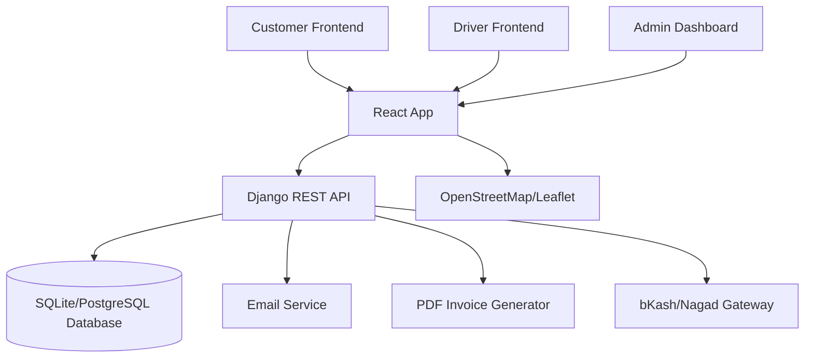
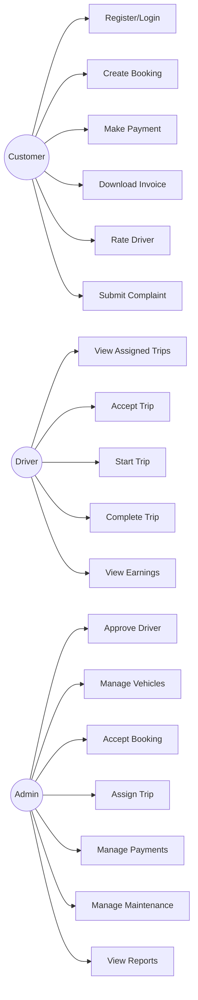
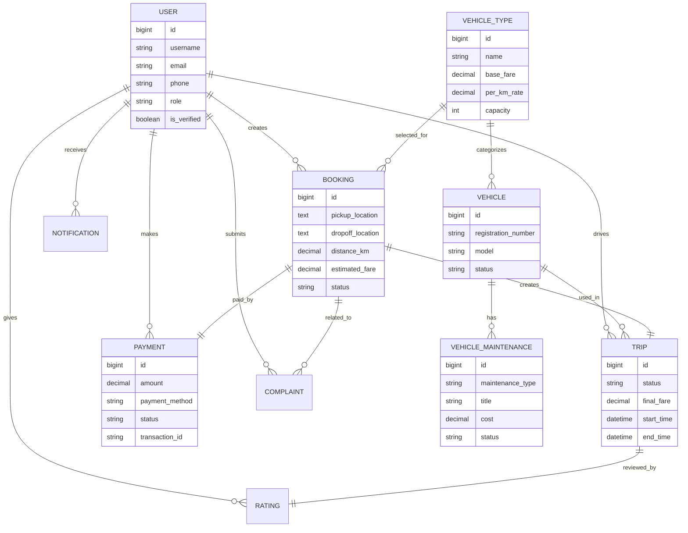
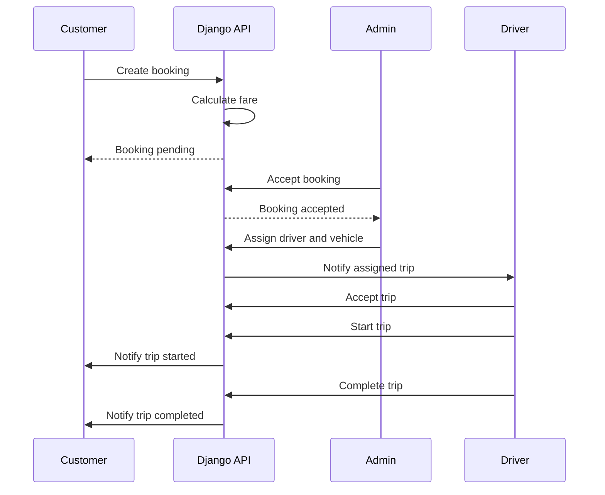
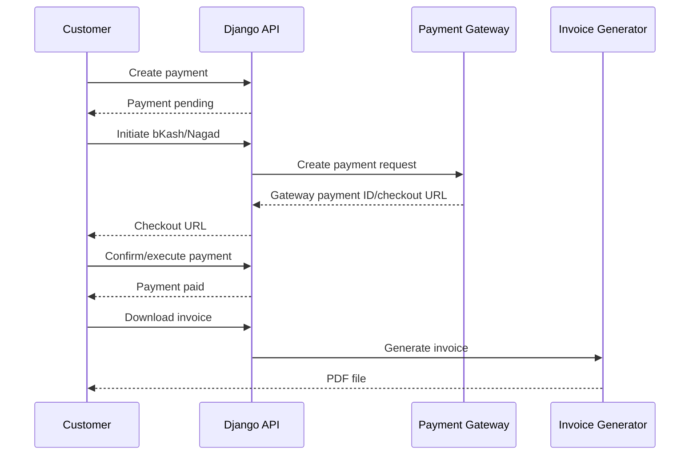

# UML and ERD Diagrams

## 1. System Architecture Diagram

```mermaid
graph TD
    A[Customer Frontend] --> D[React App]
    B[Driver Frontend] --> D
    C[Admin Dashboard] --> D
    D --> E[Django REST API]
    E --> F[(SQLite/PostgreSQL Database)]
    E --> G[Email Service]
    E --> H[PDF Invoice Generator]
    E --> I[bKash/Nagad Gateway]
    D --> J[OpenStreetMap/Leaflet]
```

## 2. Use Case Diagram

```mermaid
graph LR
    Customer((Customer)) --> C1[Register/Login]
    Customer --> C2[Create Booking]
    Customer --> C3[Make Payment]
    Customer --> C4[Download Invoice]
    Customer --> C5[Rate Driver]
    Customer --> C6[Submit Complaint]

    Driver((Driver)) --> D1[View Assigned Trips]
    Driver --> D2[Accept Trip]
    Driver --> D3[Start Trip]
    Driver --> D4[Complete Trip]
    Driver --> D5[View Earnings]

    Admin((Admin)) --> A1[Approve Driver]
    Admin --> A2[Manage Vehicles]
    Admin --> A3[Accept Booking]
    Admin --> A4[Assign Trip]
    Admin --> A5[Manage Payments]
    Admin --> A6[Manage Maintenance]
    Admin --> A7[View Reports]
```

## 3. ERD Diagram

```mermaid
erDiagram
    USER ||--o{ BOOKING : creates
    USER ||--o{ TRIP : drives
    USER ||--o{ PAYMENT : makes
    USER ||--o{ RATING : gives
    USER ||--o{ COMPLAINT : submits
    USER ||--o{ NOTIFICATION : receives

    VEHICLE_TYPE ||--o{ VEHICLE : categorizes
    VEHICLE_TYPE ||--o{ BOOKING : selected_for
    VEHICLE ||--o{ TRIP : used_in
    VEHICLE ||--o{ VEHICLE_MAINTENANCE : has

    BOOKING ||--|| TRIP : creates
    BOOKING ||--|| PAYMENT : paid_by
    BOOKING ||--o{ COMPLAINT : related_to

    TRIP ||--|| RATING : reviewed_by

    USER {
        bigint id
        string username
        string email
        string phone
        string role
        boolean is_verified
    }

    VEHICLE_TYPE {
        bigint id
        string name
        decimal base_fare
        decimal per_km_rate
        int capacity
    }

    VEHICLE {
        bigint id
        string registration_number
        string model
        string status
    }

    BOOKING {
        bigint id
        text pickup_location
        text dropoff_location
        decimal distance_km
        decimal estimated_fare
        string status
    }

    TRIP {
        bigint id
        string status
        decimal final_fare
        datetime start_time
        datetime end_time
    }

    PAYMENT {
        bigint id
        decimal amount
        string payment_method
        string status
        string transaction_id
    }

    VEHICLE_MAINTENANCE {
        bigint id
        string maintenance_type
        string title
        decimal cost
        string status
    }
```

## 4. Booking to Trip Sequence Diagram

```mermaid
sequenceDiagram
    participant C as Customer
    participant API as Django API
    participant A as Admin
    participant D as Driver

    C->>API: Create booking
    API->>API: Calculate fare
    API-->>C: Booking pending
    A->>API: Accept booking
    API-->>A: Booking accepted
    A->>API: Assign driver and vehicle
    API->>D: Notify assigned trip
    D->>API: Accept trip
    D->>API: Start trip
    API->>C: Notify trip started
    D->>API: Complete trip
    API->>C: Notify trip completed
```

## 5. Payment Sequence Diagram

```mermaid
sequenceDiagram
    participant C as Customer
    participant API as Django API
    participant G as Payment Gateway
    participant PDF as Invoice Generator

    C->>API: Create payment
    API-->>C: Payment pending
    C->>API: Initiate bKash/Nagad
    API->>G: Create payment request
    G-->>API: Gateway payment ID/checkout URL
    API-->>C: Checkout URL
    C->>API: Confirm/execute payment
    API-->>C: Payment paid
    C->>API: Download invoice
    API->>PDF: Generate invoice
    PDF-->>C: PDF file
```
